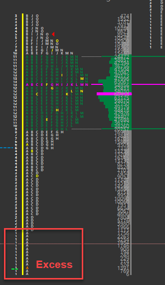

# Excess
A high or low characterized by a number of single prints that ends a move. This is the top or the bottom of a daily market profile distribution. The minimum number of TPO’s that is necessary to define an high is two, however when the excess has only a few TPO’s, it is said to be “lack of meaningful excess”. Excess is the opposite of a poor high or poor low.

{:style="display:block; margin-left:auto; margin-right:auto"}