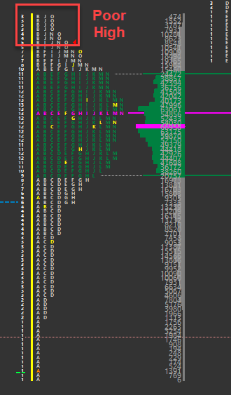

# Poor High
A poor high is one which lacks excess and is the opposite of an excess high. A poor high will have less than two TPO’s of excess at the top of a daily range with at least 2-3 columns of TPO’s lining up to form a flat looking top. It indicates that there are short term or weak handed longs at that high of day area. We know this because every time prices rise to the top, they get sold quickly, thus forming the poor high.

The poor high has two forward looking indications. The first is that prices should back away from the poor high as there are a number longs trapped at poor location. The second is that if the next day or in some subsequent session, the poor high is revisited, then the odds are strong that it will break and move higher. This is called repair as it repairs the structure of the poor high that lacked symmetry without a proper “top”.

{:style="display:block; margin-left:auto; margin-right:auto"}