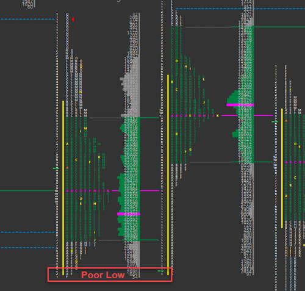

# Poor Low
A poor low is one which lacks excess (two or more ticks) and is the opposite of an excess low. A poor low will have less than two TPO’s of excess at the bottom of a daily range with at least two columns of TPO’s lining up to form a flat looking bottom. It indicates that there are shorts trapped at that low of day area. We know this because every time prices sell off to the low, they get covered quickly, thus forming the poor low.

{:style="display:block; margin-left:auto; margin-right:auto"}